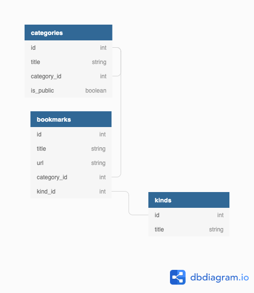

# README

## Heroku Link

**https://warm-cove-11013.herokuapp.com/**

### Versiones

* Ruby: ruby-2.6.6
* Rails 6.0.3.6

###

- [x] El diagrama de relaciones para los modelos propuestos es el siguiente.



- [x] El CRUD para la administración de categorías, marcadores y tipos, se realizó con **scaffolds**.

- [x] Se define el endpoint **https://localhost:3000/retrieve/:category_id** para retornar un JSON con los datos de una categoría (incluyendo subcategorías y marcadores). El esquema json es el siguiente:  

* Categoria: Describe la categoria llamada desde el endpoint a partir de su **id**.
* Bookmarks: Si la categoría es pública, aquí se mostrarán los bookmarks asociados a esa categoría.
* Subcategorías: Listado de las sub-categorías asociadas a esta categoría. 

- [x] El archivo JSON se construye con el siguiente método

```ruby
  def retrieval
    @bookmarks = Bookmark.where(category_id: id)
    content = [ { 'Category': [] }, {'Bookmarks': []}, {'Subcategories': []} ]

    content[0]['Category'] = {
      category_id: id,
      category_name: name,
      is_public: is_public,
      parent_category: category_id
    }

    if is_public
      bookmarks_array = []
      @bookmarks.each do |bookmark|
        bookmarks_hash = {
          id: bookmark.id, 
          name: bookmark.name, 
          url: bookmark.url,
          category_id: bookmark.category_id,
          kind_id: bookmark.kind_id, 
          created_at: bookmark.created_at,
          updated_at: bookmark.updated_at
        }
        bookmarks_array.append(bookmarks_hash)
      end
      content[1]['Bookmarks'] = bookmarks_array

      parents_array = []
      self.children.each do |child|
        unless child.nil?
          children_hash = child.retrieval
          parents_array.append(children_hash)
        end
      end

      content[2]['Subcategories'] = parents_array
    else
      content[1]['Bookmarks'] = 'This category is not open to public'
      content[2]['Subcategories'] = 'This category is not open to public'
    end 

    content
  end

```

- [x] Se ha definido un método para buscar a las subcategorías de una categoría. Esta se ha definido en el modelo **Category**.

```ruby

  def children
    children = []
    Category.where(category_id: id).each do |child|
      children.append(child)
      unless child.category_id.nil?
        children.append(child.children)
      end
    end
    children.flatten
  end

```